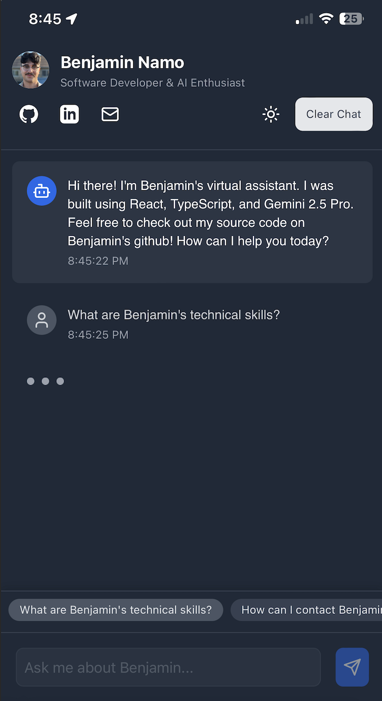

# Personal Portfolio Chatbot

A modern, interactive chatbot that serves as your personal portfolio. Visitors can ask questions about your skills, experience, projects, and more, receiving natural language responses powered by AI.



## Features

- 🤖 Interactive AI chatbot that answers questions about you
- 🌓 Dark/light mode toggle
- 📱 Fully responsive design
- ⚡ Fast loading with Vite
- 🔍 Quick questions for easy exploration
- 🛠️ Customizable with your own information
- 🔄 Fallback models for reliable responses

## Tech Stack

- React
- TypeScript
- Vite
- TailwindCSS
- OpenRouter AI API

## Getting Started

### Prerequisites

- Node.js (v14 or higher)
- npm or yarn
- An OpenRouter API key - [Get one here](https://openrouter.ai/keys)

### Installation

1. Clone the repository:
   ```
   git clone https://github.com/yourusername/portfolio-chatbot.git
   cd portfolio-chatbot
   ```

2. Install dependencies:
   ```
   npm install
   ```

3. Create a `.env` file in the root directory:
   ```
   VITE_OPENROUTER_API_KEY=your-openrouter-api-key
   VITE_OPENROUTER_MODEL=google/gemini-pro:latest
   ```

4. Create your personal data file:
   ```
   cp src/lib/data.ts src/lib/personal-data.ts
   ```
   Then edit `src/lib/personal-data.ts` with your personal information.

5. Start the development server:
   ```
   npm run dev
   ```

### Customization

#### Profile Picture

1. Replace the file `public/benjamin.svg` with your own profile picture (ideally in SVG format, but PNG/JPG work too).
2. If using a different file format, update the reference in `src/App.tsx`.

#### Custom Icons

- GitHub and LinkedIn icons are in `public/github.svg` and `public/linkedin.svg` - you can replace these with your preferred icons.

#### Theme Colors

- Edit the TailwindCSS classes in `src/App.tsx` to change the theme colors.
- Main color classes to modify are `bg-blue-600`, `text-blue-500`, etc.

## Deployment

### Building for Production

1. Build the project:
   ```
   npm run build
   ```

2. The built files will be in the `dist` directory, ready to be deployed to your hosting provider.

### Hosting Options

#### GitHub Pages

1. Create a `.github/workflows/deploy.yml` file for GitHub Actions:
   ```yaml
   name: Deploy to GitHub Pages

   on:
     push:
       branches: [ main ]

   jobs:
     build-and-deploy:
       runs-on: ubuntu-latest
       steps:
         - uses: actions/checkout@v2
         
         - name: Install dependencies
           run: npm ci
           
         - name: Build
           run: npm run build
           env:
             VITE_OPENROUTER_API_KEY: ${{ secrets.OPENROUTER_API_KEY }}
             
         - name: Deploy
           uses: JamesIves/github-pages-deploy-action@4.1.4
           with:
             branch: gh-pages
             folder: dist
   ```

2. Configure your repository's GitHub Pages settings to deploy from the `gh-pages` branch.

#### Netlify/Vercel

Both Netlify and Vercel support automatic deployment from GitHub repositories.

1. Connect your GitHub repo to Netlify/Vercel
2. Add `VITE_OPENROUTER_API_KEY` as an environment variable in your project settings
3. Set the build command to `npm run build` and the publish directory to `dist`

## API Key Security

Never commit your API keys to the repository. Always use environment variables:

- During development: Use `.env` files (which are gitignored)
- In production: Use your hosting provider's environment variables feature

## Additional Notes

### OpenRouter API

This project uses OpenRouter API which provides access to various AI models. The default model is Google's Gemini Pro, but you can change it to other models like Claude or GPT in the `.env` file.

### Performance Optimization

For better performance:
- Consider using a CDN for your profile picture and other assets
- Enable caching headers on your hosting provider
- Use a custom domain with HTTPS

### Troubleshooting

If you encounter issues with the AI responses:
1. Check your OpenRouter API key is valid
2. Try a different model by changing the `VITE_OPENROUTER_MODEL` variable
3. Check the browser console for specific error messages

## License

MIT

## Author

[Your Name](https://yourwebsite.com) 